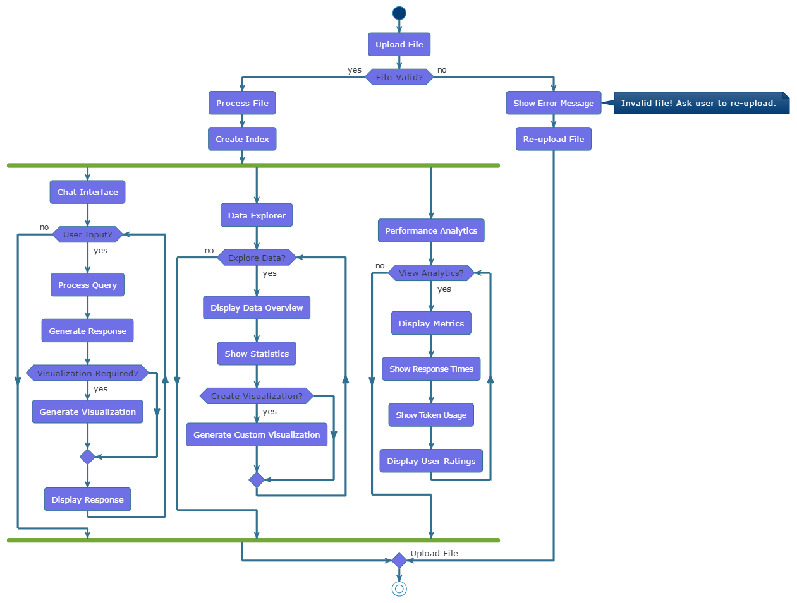

# 📊 DataQnA AI – Natural Language Data Analytics

DataQnA AI is an intelligent platform that empowers users to interact with structured and big data through natural language queries. Built using Retrieval-Augmented Generation (RAG), it bridges the gap between complex data tools and business users by offering intuitive insights—no coding required.

---

## 🚀 Features
- 🔍 **Natural Language Interface**: Query data conversationally.
- 📊 **Auto-Visualization**: Generates charts/graphs based on queries.
- 🧠 **RAG Model Integration**: Combines retrieval with LLMs for accurate, contextual responses.
- 📁 **Flexible Uploads**: Accepts multiple file formats.
- 📈 **Interactive Filtering**: Filter, explore, and export data easily.
- 📤 **Export Options**: Download visualizations and results.
- 🔒 **Feedback & Performance Tracking**: Collect user feedback and monitor performance.

---

## 📐 System Design & Diagrams

### 🔷 Use Case Diagram
Shows the interaction between users and system components.

### 🔄 Activity Diagram
Illustrates how a user interacts from query input to result output.

### 🔁 Sequence Diagram
Demonstrates the flow of control between frontend, backend, and LLM during query processing.

### 🧠 System Flow Diagram
High-level architecture showing modules like Chat, Data Explorer, Feedback, and Vector Store.

---

## 📦 Modules

### 1. Chat Interface
- Natural language query engine
- Visualization suggestions
- User feedback collection

### 2. Data Explorer
- File upload & validation
- Data summary & filtering
- Visualization creation & export

### 3. Performance Analytics
- Tracks response time & token usage
- Collects feedback and usage data

---

## 👥 Users

Ideal for:
- Data Analysts  
- Business Users  
- Researchers  
- Anyone exploring data without coding  

---

## ⚙️ Tech Stack

| Layer        | Technology                              |
|--------------|------------------------------------------|
| **Frontend** | Streamlit                                |
| **Backend**  | Python                                    |
| **AI Model** | Mistral via OpenRouter                   |
| **Embeddings** | BAAI/bge-large-en-v1.5                |
| **Vector Stores** | LlamaIndex, MongoDB, Qdrant, Neo4j |
| **Libraries** | pandas, numpy, plotly, llama-index, huggingface-hub, openpyxl |

---

## 🗃️ Data Dictionary (Sample)

| Field          | Description                        |
|----------------|------------------------------------|
| `id`           | Unique session ID                  |
| `file_cache`   | Cached file & query engine         |
| `messages`     | Chat history                       |
| `response_times` | Query performance log           |
| `ratings`      | User feedback on accuracy          |

---

## 📈 Visualization Support

| Chart Type | Required Columns | Description                      |
|------------|------------------|----------------------------------|
| Bar        | x, y             | Categorical comparison           |
| Line       | x, y             | Trends over time                 |
| Scatter    | x, y             | Relationship between variables   |
| Pie        | x, y             | Proportion of categories         |
| Histogram  | x                | Distribution of a single variable|
| Heatmap    | x, y             | Correlation matrix               |

---

## 🧪 Test Coverage

Includes:
- Module-wise test cases  
- Edge case handling  
- User feedback testing  
- Performance validation

---

## 🔮 Future Enhancements

- 📞 Voice-based querying  
- 👥 Multi-user dashboards  
- 🧩 SQL database support  
- 🔁 Switch between multiple LLMs  
- 🔐 Improved privacy and security  

---

## 📚 References

- [Google Cloud: Introducing Data QnA](https://cloud.google.com/blog/products/data-analytics/introducing-data-qna)
- [Demo Videos on YouTube](https://youtu.be/30_0j0XYOas)

---

## 🙏 Acknowledgements

- **Developer**: Naman Jain  
- **Internal Guide**: Prof. Honey Shivnani
